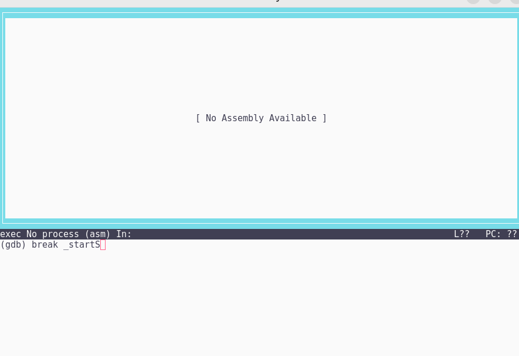
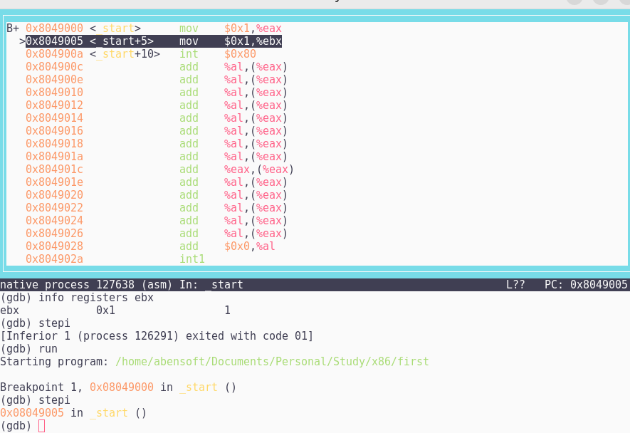

ld -m elf_i386 -o first first.o

nasm -f elf -o first.o first.as

gdb #file 

layout asm -> break _start

run -> to start running.
stepi -> go one instruction forward
info registers eax -> show register information (0x1)
(or another register), ebx

x/x $ebx - this prints value and adress in register

 A byte
is eight bits. Two bytes side by side are called a word, and two words side
by side are called a double word. A quad word, as you might imagine, consists
of two double words, for four words or eight bytes in all. Going in the other
direction, some people refer to a group of four bits as a nybble—a nybble being
somewhat smaller than a byte.

	num DD 5
        ; defines 5, 32 bits allocated inside var
	; DB DEFINE BYTE 8 bits, 1 byte 
    DW DEFINE WORD 2 bytes 16 bits 
	; DD DEFINE DOUBLE WORD 32 bits 
    DQ DEFINE QUAD WORD 64 bits DT 80 bits
        
